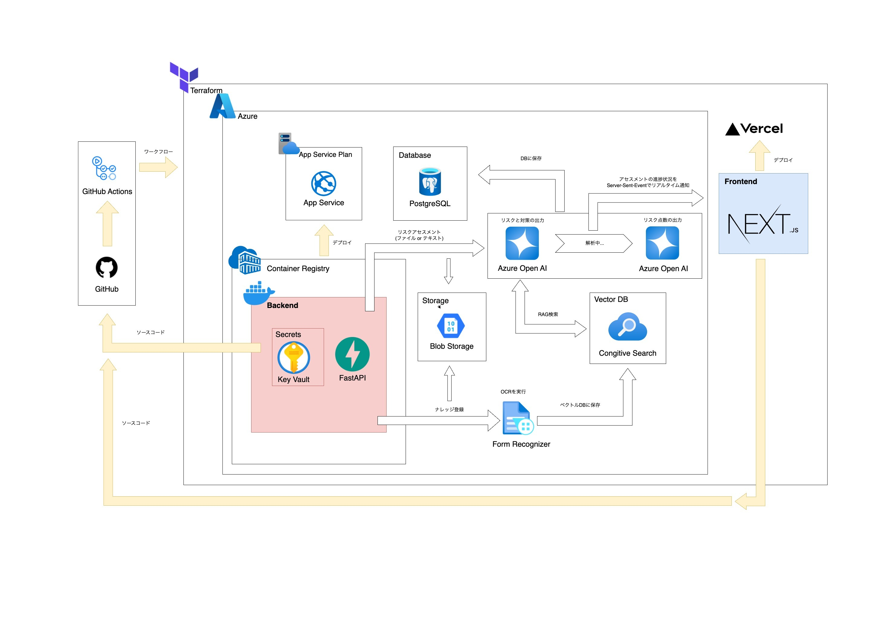

# 概要
## はじめに
第一施設工業工業様のリスクアセスメントRAGシステムです。

## 主な使用技術
- フロントエンド
  - 言語：TypeScript
  - フレームワーク：Next.js(App Router)
  - スタイル：Tailwind CSS
  - 状態管理：
  - コード整形・静的解析：Prettier・ESLint
  - デプロイ：Vercel
- バックエンド
  - 言語：Python
  - フレームワーク：FastAPI
  - コンテナ：Docker
  - ORM：SQLAlchemy
  - デプロイ：Azure(Container Registry + App Service)
- 認証：FastAPI
- データベース：Azure Database for PostgreSQL
- CI/CD・IaC：GitHub Actions, Terraform
- インフラ基盤
  - クラウドサービス：Azure
  - バックエンド（FastAPI）のホスティングとスケーリング：App Service / App Service Plan
  - バックエンド用Dockerイメージの管理・配信：Container Registry  
  - データベースサービス：Azure Database for PostgreSQL  
  - ファイルストレージ：Blob Storage  
  - シークレット・認証情報管理：Key Vault  
  - ベクトルDB/全文検索：Cognitive Search  
  - OCR/構造化データ抽出：Form Recognizer  
    
## システムフロー
1. ユーザーがフロントエンドからファイルやテキストをアップロード
2. Form RecognizerでOCR・構造化、必要に応じてBlob Storageへ保存
3. 解析情報をCognitive Search (ベクトルDB)に登録
4. OpenAIでリスクアセスメントやチャット生成
5. 結果をDBに保存


## ブランチ管理
- main
  - 本番運用するソースコードを管理するブランチ
- develop
  - 開発作業用のブランチ
  - 普段の開発はこのブランチからfeatureブランチを切る
- feature
  - developブランチから作成するブランチ
  - 新しい機能の開発など
  - ブランチ名はfeature/{issue番号}-{作業内容}
     - 例: feature/2-create-frontend


## 開発環境
### 前提条件
- Node.js(v22.6以上)
- npm(v10.8以上)
- Git
- Docker

### パッケージのインストール
```
cd frontend
npm install
```

### ローカルサーバーの起動
- フロントエンド
`npm run dev`を実行後、http://localhost:3000 にアクセス

- バックエンド
`docker-compose up --build`を実行後、http://localhost:8000 にアクセス

### フロントエンド環境
随時更新します。

### バックエンド環境
随時更新します。


