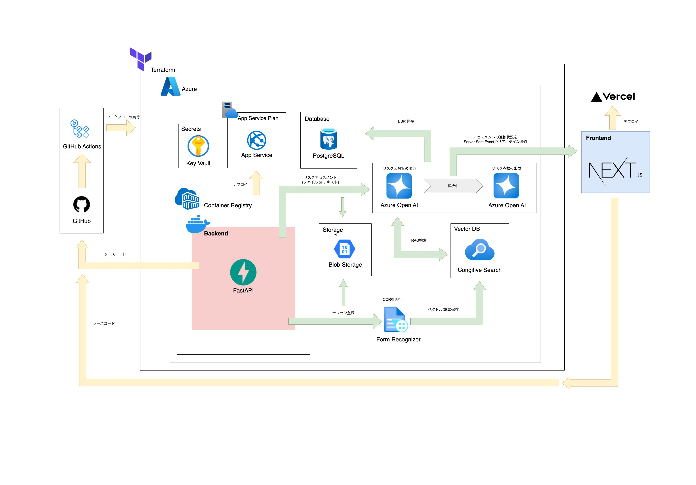

# 概要
第一施設工業工業様のリスクアセスメントRAGシステムです。

## 主な使用技術
- フロントエンド
  - 言語：TypeScript
  - フレームワーク：Next.js(App Router)
  - スタイル：Tailwind CSS
  - コード整形・静的解析：Prettier・ESLint
  - デプロイ：Vercel
- バックエンド
  - 言語：Python
  - フレームワーク：FastAPI
  - コンテナ：Docker
  - ORM：SQLAlchemy
  - デプロイ：Azure(Container Registry + App Service)
- 認証：FastAPI
- データベース：Azure Database for PostgreSQL
- CI/CD・IaC：GitHub Actions, Terraform
- インフラ基盤
  - クラウドサービス：Azure
  - バックエンド（FastAPI）のホスティングとスケーリング：App Service / App Service Plan
  - バックエンド用Dockerイメージの管理・配信：Container Registry  
  - データベースサービス：Azure Database for PostgreSQL  
  - ファイルストレージ：Blob Storage  
  - シークレット・認証情報管理：Key Vault  
  - ベクトルDB/全文検索：Cognitive Search  
  - OCR/構造化データ抽出：Form Recognizer  
    
## システムフロー
1. ユーザーがフロントエンドからファイルやテキストをアップロード
2. Form RecognizerでOCR・構造化、必要に応じてBlob Storageへ保存
3. 解析情報をCognitive Search (ベクトルDB)に登録
4. OpenAIでリスクアセスメントやチャット生成
5. 結果をDBに保存


## ブランチ管理
- main
  - 本番運用するソースコードを管理するブランチ
- develop
  - 開発作業用のブランチ
  - 普段の開発はこのブランチからfeatureブランチを切る
- feature
  - developブランチから作成するブランチ
  - 新しい機能の開発など
  - ブランチ名はfeature/{issue番号}-{作業内容}
     - 例: feature/2-create-frontend


# フロントエンド環境
## 前提条件
- Node.js(v22.6以上)
- npm(v10.8以上)

## パッケージのインストール
```
# frontendディレクトリに移動
cd frontend

# パッケージのインストール
npm install
```

## ローカルサーバーの起動
`npm run dev`を実行後、http://localhost:3000 にアクセス

## ディレクトリ構成
```
frontend/
├── app/                # ページルーティング定義
├── api-client/         # 自動生成したAPIクライアントコード
├── components/         # UIコンポーネント群
├── fetch/              # API通信のラッパー関数
├── hooks/              # React用のカスタムフック
├── lib/                # 汎用ロジックやユーティリティ関数
├── types/              # 型定義
├── openapi.json        # FastAPIから出力されたOpenAPIスキーマファイル
└── package.json        # 依存パッケージ・スクリプト定義
```

## APIクライアントコードの自動生成
  ```
  # openapi.jsonの更新
  curl http://localhost:8000/openapi.json -o openapi.json
  # frontendディレクトリに移動
  cd frontend
  # OpenAPI GeneratorによるTypeScriptクライアントの生成
  npm run gen
  ```

# バックエンド環境
## 環境構築
### 前提条件
- Docker

### パッケージのインストール
```
# backendディレクトリに移動
cd backend
# backendコンテナに直接入る
docker-compose exec -it backend bash
# コンテナ内でインストール
poetry install
```

### 環境変数の設定
```
cp .env.example .env.local
```

### ローカルサーバーの起動
`docker-compose up --build`を実行後、http://localhost:8000 にアクセス

## ディレクトリ構成
```
backend/
├── alembic/                      # DBマイグレーション管理
│   ├── versions/                 # マイグレーションファイル
│   ├── env.py                    # Alembic環境設定
│   └── script.py.mako            # マイグレーション用テンプレート
├── app/                          
│   ├── db/                       # DB接続とモデル定義
│   │   ├── db.py                 # SQLAlchemyのSession管理、DB接続設定
│   │   ├── models/               # ORMモデル定義
│   │   └── schemas/              # \Pydanticスキーマ
│   ├── middleware/               # ミドルウェア
│   ├── repositories/             # DBアクセス層
│   ├── usecases/                 # ビジネスロジック層
│   ├── routers/                  # FastAPIのルーター定義
│   ├── services/                 # 外部サービス連携
│   └── main.py                   # アプリのエントリーポイント
├── docker-compose.yml            # 開発用Docker構成
├── Dockerfile                    # FastAPIのDockerイメージ定義
├── pyproject.toml                # Poetry設定ファイル
└── .env.local                    # 環境変数（ローカル用）
```

### レイヤー構成
DDD にインスパイアされたレイヤー構成で、責務ごとにディレクトリを分割
- routers/：HTTP リクエストのエントリーポイント（Controller 的役割）
- usecase/：ユースケース（ビジネスロジック）を定義
- repositories/：データの取得・更新など、永続化層とのやり取りを定義
- services/：Firebase などの外部 API やクラウドサービスと連携
- schemas/：リクエスト・レスポンスや DB スキーマの型定義

## 開発ガイド
### DBのマイグレーション・テーブルの確認
```
# backendコンテナに直接入る
docker-compose exec -it backend bash
# マイグレーションファイルの作成
poetry run alembic revision --autogenerate -m "<メッセージ>"
# マイグレーションの実行
poetry run alembic upgrade head
```

```
# dbコンテナに直接入る
docker-compose exec -it db bash
# PostgreSQLに移動
psql -U postgres -d postgres
# 特定のテーブルの中身を確認
SELECT * FROM users;
# テーブル一覧を確認
\dt:
```

### APIドキュメントの確認
```
# Swagger UIの確認
localhost:8000/docs
# openapi.jsonの確認
localhost:8000/openapi.json
```

